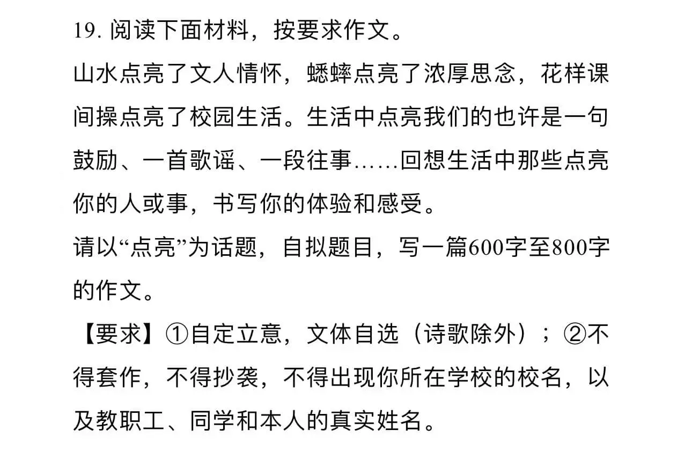
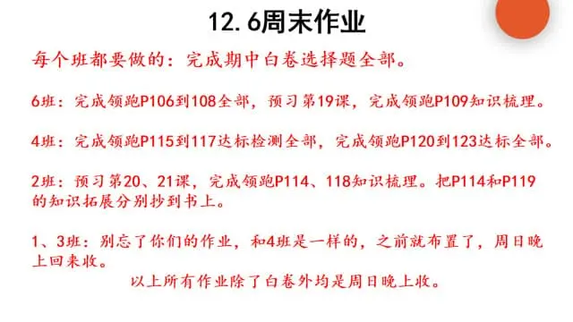
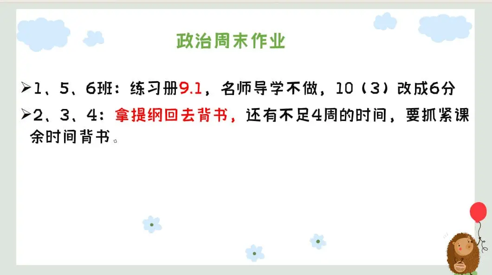

### 语文作业

1. 
2. 《周末作业》十一（P20-22）

---

### 数学作业

1. 《导学案》P104-105
2. 《课时分层作业》P53

---

### 英语作业

1. 《课时分层作业本》M10U2~模块综合能力提升（P66-70）
2. 翼课网
3. 口语易

---

### 地理作业

- 学导练大本 80-83 页工业部分，素养要写。
  - 红笔改正。周日收。

---

### 历史作业

---

### 生物作业

1. 《金榜学案》P119-123
2. 将笔记[1](./_images/14b1.webp ":target=_self")
   [2](./_images/14b2.webp ":target=_self")
   [3](./_images/14b3.webp ":target=_self")做回书本 P34-35 空白处

---

### 物理作业

- 《同步课堂本》 第 5 节 光的色散
  - 订正，周日晚收

---

### 政治作业

---
