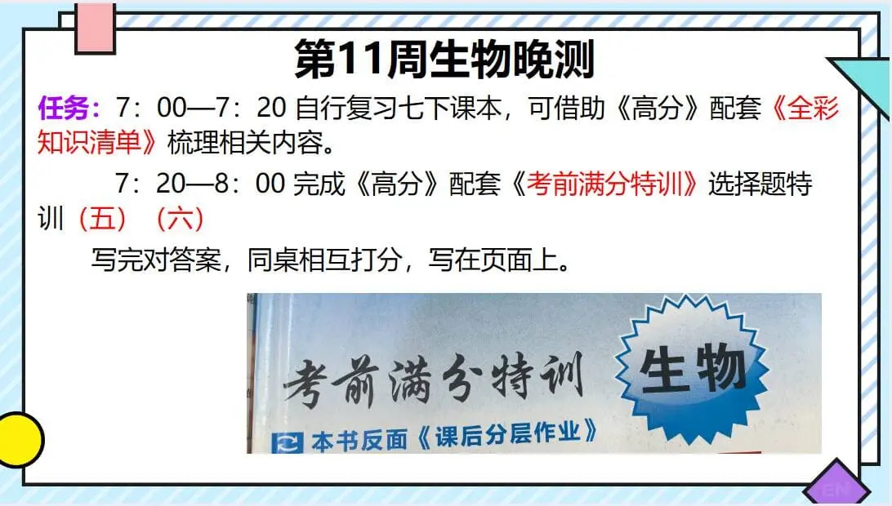

### 语文作业
* 积累摘抄，主题为“菊”，或者花类的都可以
---

### 数学作业
* 《数学同步训练》P1 P2 P3 P4 P14
---

### 英语作业
1. 《高分突破》M6U1 P70-74
2. 《喜阅阅读》P54 P55
3. 口语易（这周要做完4月检测）
---

### 地理作业
* 一张灰卷
---

### 历史作业
* **无**
---

### 生物作业
1. 这是下周日周测内容，去物理数学考试的同学周末可以提前做了
2. 根据期中考总结自己哪些内容薄弱，查漏补缺
3. 带高分突破回去复习，应战二模
4. 做高分突破大本“人的由来”剩余的题和P227-P234
5. 做高分突破大本P76-P83

---

### 物理作业
* 完成 **长白卷（三）**
---

### 政治作业
* **无**
---
