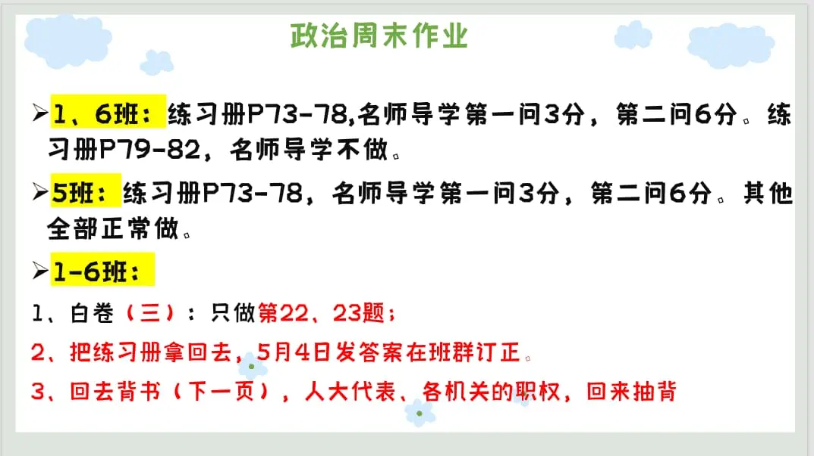
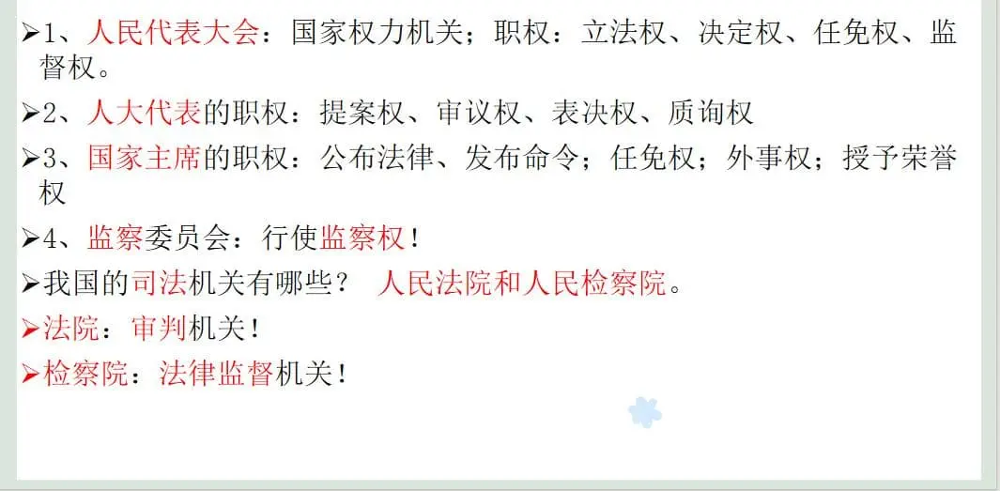

### 语文作业
* **无**
> 下周演讲主题：来日并不方长
---

### 数学作业
1. 《导学案》P72-73
2. 《课时分层作业》P36
3. 同步训练21到24页
---

### 英语作业
1. 《高分突破》M7U2 P89-92
2. 《喜阅阅读》P67-68 P74-76
3. 手抄报
---

### 地理作业
1. 高分突破写到79页
2. 白卷 复习学案（四）。
> 五一记得复习生物地理，地理的《重难点专题突破》和《分层作业本》都可以写了，有空你们就写。
---

### 历史作业
* 完成**复习学案三**全部
---

### 生物作业
1. 高分突破大本P227-241
2. 完成**生物模拟试卷（一）**，写上班别、姓名、学号，五一回来那晚交
3. 配套“阶段检测卷（一）”，回来那晚收
4. 完成高分突破配套“基础知识特训卷一”的“三、第三单元基础知识”
5. 配套“彩色填图册”的P8-P13
---

### 物理作业
1. 《课下本》第十章第3节 P55-56+专题6 60-61+专题7 P62-63
2. 参加核心素养决赛的同学自行完成去年的试卷并订正
* [答案](https://view.officeapps.live.com/op/embed.aspx?src=https://github.com/CMSZ002/hw/releases/download/latest/12phs.docx)
---

### 政治作业

---
