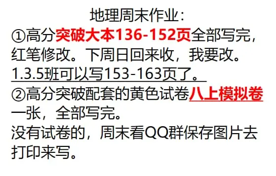
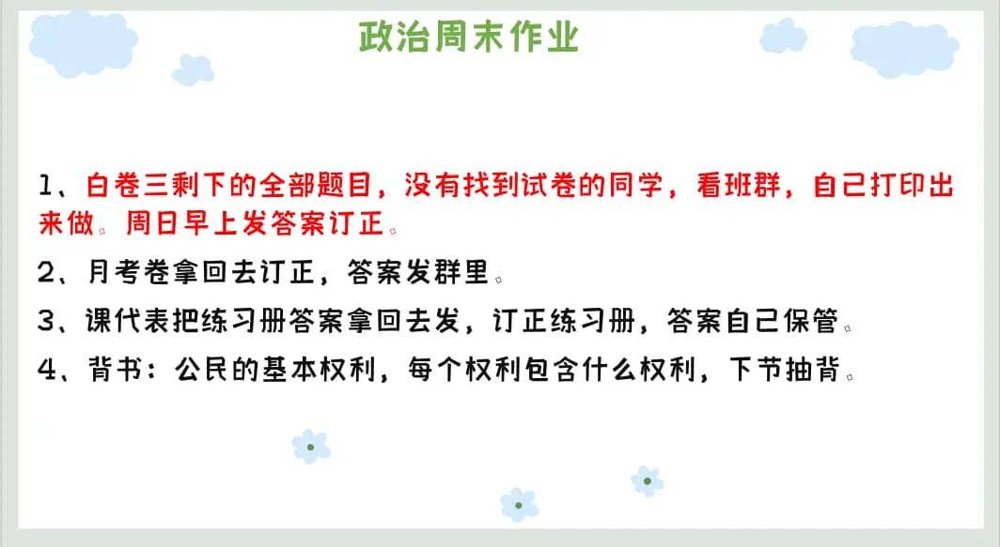

### 语文作业
1. 高分突破159～160
2. 素材积累主题：梦想
---

### 数学作业
1. 《导学案》P16-17
2. 《课时分层作业》P8
---

### 英语作业
1. 《喜阅阅读》P89-90
2. 《周末培优特训》P8-9
3. 背M8 M9单词短语 下周默写
4. 口语易
---

### 地理作业

---

### 历史作业
* **无**
---

### 生物作业
1. 高分配套“彩色填图册”P19-22
2. 高分配套试卷“八年级生物教材基础知识特训卷（一）”
3. 下发的综合模拟卷（三），限时50分钟完成，对答案，预测分数，记错题
4. 大本练习册做到P189
---

### 物理作业
* **笫九章 单元测试卷**
---

### 政治作业

* [月考卷答案](https://view.officeapps.live.com/op/embed.aspx?src=https://github.com/CMSZ002/hw/releases/download/latest/17p.docx)
---
