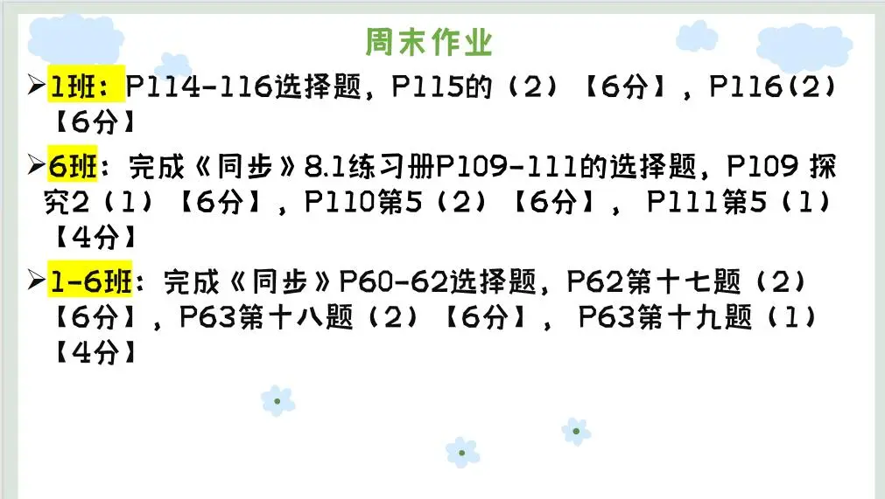

### 语文作业
- 周末作业13页，17页
---

### 数学作业
1. 《导学案》P93 P98
2. 《课时分层作业本》P45
---

### 英语作业
1. 《课时分层作业本》M7U3 P41-42
2. 《高分突破》M7U3（写作模块不写）P81-83
3. 作文[M7 Writing](https://view.officeapps.live.com/op/view.aspx?src=https://github.com/CMSZ002/hw/releases/download/G9S1/M7.Writing.pptx)
---

### 化学作业
1. 《同步随堂练》P77-78
2. 《课后作业》P43
---

### 历史作业
- 《领跑》P110到112全部
---

### 物理作业
- 《分层作业》 微专题9 P64 第4节第1课时 P68-69
---

### 政治作业

---
