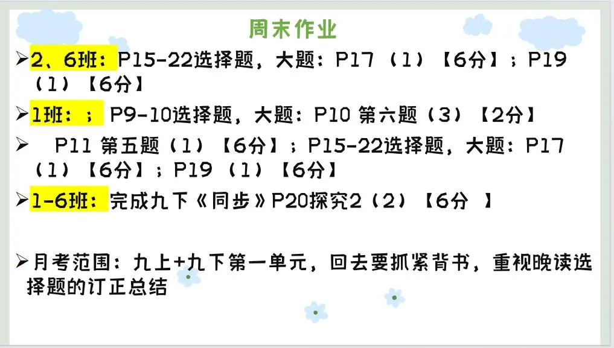

### 语文作业
1. 复习学案（四）1～15题
2. 复习九上三篇文言和诗词，周日回来周测
---

### 数学作业
1. 《导学案》P117-122（P122第7题选做）
2. 《课时分层作业本》P52

---

### 英语作业
1. 《高分突破》M9U2 M9U3 P103-108
2. 《课时分层作业本》M9U2 M9U3 P51-54
---

### 化学作业
- 《领跑》P98 P101-102
---

### 历史作业
- **无**
---

### 物理作业
- 《分层作业》P89-90
---

### 政治作业

---
