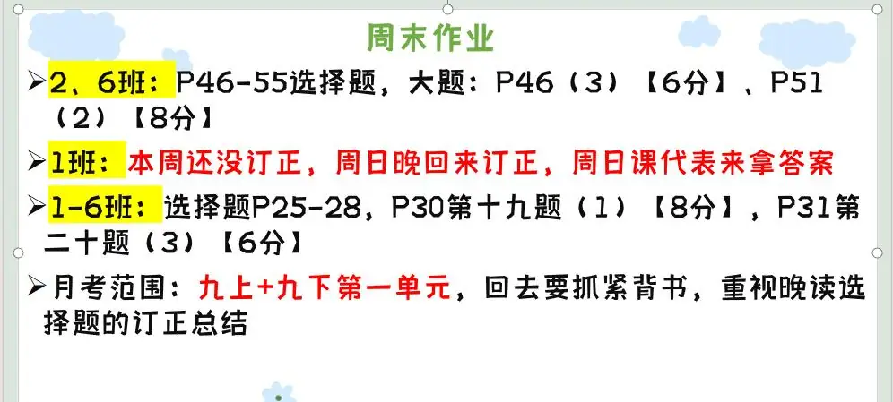

### 语文作业
- 复习学案（期中）1~14
---

### 数学作业
1. 阶段测试卷（六）
2. 《导学案》P133-136
---

### 英语作业
1. 用作文本写《高分突破》P122 M10U3作文
2. 《喜阅阅读》 P64-65
---

### 化学作业
- 《领跑》P110 P112-113
---

### 历史作业
- 《领跑》P142-144
---

### 物理作业
- 复习学案（五）
---

### 政治作业

---
