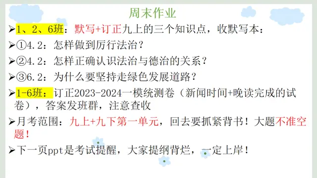

### 语文作业
1. 根据月考范围复习
2. 完成**中考访真模拟测试卷**对应题目
    1. 85分至以上：2-11题 13-14题 16-18题
    2. 85分以下：1-5题 7-9题 12题 15题
---

### 数学作业
1. 复习学案（期中）22-23题
2. 《课时分层作业》P66-67
---

### 英语作业
1. 《高分突破》M11U3（**写作步步高**不写）P131-133
2. 《课时分层作业本》M11U3 P65-66
---

### 化学作业
- **无**

**九上第二次月考化学试卷**下载地址（点击展开）

- [Gitee分流（推荐）](https://gitee.com/CMSZ001/hw/releases/download/G9S1/15ch.docx)
- [Github分流](https://github.com/CMSZ002/hw/releases/download/G9S1/15ch.docx)

---

### 历史作业
1、完成领跑P149到151、P155到158
2、把两本历史书、这两天做的三张卷带回去认真查漏补缺，考试范围九上全部加九下前12课，认真复习，还是很有希望的
---

### 物理作业
- **复习**
---

### 政治作业
  
  
[23-24年统测卷](https://view.officeapps.live.com/op/view.aspx?src=https://github.com/CMSZ002/hw/releases/download/G9S1/15p.pptx)

---
