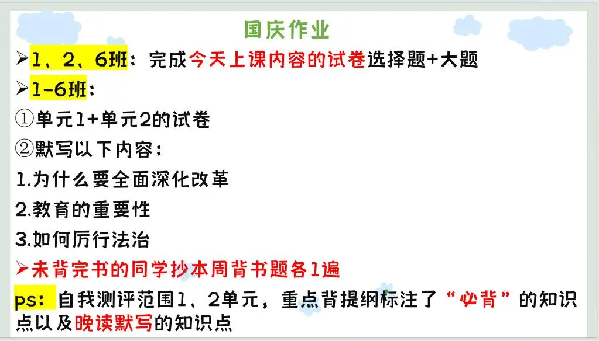

### 语文作业
1. 月考卷一二，做完订正答案
2. 一篇议论文题目为月考卷二的（作文纸写）
3. 背诵第三单元文言课文，词汇、句子翻译，学过的诗词。
---

### 数学作业
1. 作业本写导学案错题（不用抄题目）
2. 导学案61、62页 。课时作业27页
3. 试卷一张
---

### 英语作业
1. 喜阅7篇，每天1篇 P12 P14 P16 P18 P19 P20 P23
2. 周末培优特训一到四 P1-4
3. 用抄写本把4篇作文抄一次（我已经发群里）。
4. 超时没有背诵课文的，每篇抄5遍。
5. M1-M4的小测卷“单词小测”部分，并做好错题复盘。
---

### 化学作业

---

### 历史作业
1. 试卷一张
2. 领跑P71到76全部
- 考试范围：第一课到第十六课
---

### 物理作业
- **九年级-物理**试卷
---

### 政治作业

---
