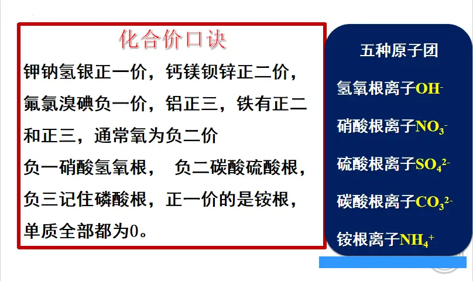

### 语文作业
- 根据自己的学号做对应人物小传
> 不会画画的可以打印出来涂色，要求为A4纸，要有绰号，外貌，主要事件，性格特征（AB面），结局，上梁山原因  
[学号对应人物](/G9S1/7c)
---

### 数学作业
- 《导学案》P77-78
---

### 英语作业
- 《课时分层作业本》M5U3 29-30
---

### 化学作业
1. 大本：50-51
2. 背化合价公式。周一默写

---

### 历史作业
1. 预习第19课
2. 《领跑》P86
3. 将P87知识拓展抄书本上
---

### 物理作业
- **第十五章 阶段检测卷**
---

### 政治作业
1. 订正作业本到6.2的内容
2. 用作业本默写并自行打分、订正以下的知识点
    1. 5.1：1（3）中华文化的特点？
    2. 5.1：8、为什么要弘扬中华传统美德？
    3. 5.2：9、为什么要弘扬社会主义核心价值观？

[6.2共筑生命家园练习答案](https://view.officeapps.live.com/op/embed.aspx?src=https://github.com/CMSZ002/hw/releases/download/G9S1/7p.pptx)

---
