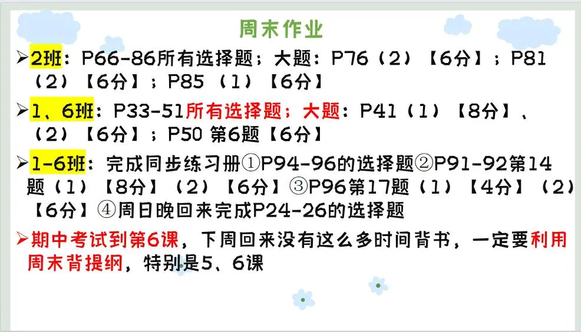

### 语文作业
1. 高分突破39～40
2. 复习所有古诗和文言，字词，看复习资料。
---

### 数学作业
- 两张试卷
---

### 英语作业
- 完成复习学案（二）（作文也写）
---

### 化学作业
- 《同步随堂练》P67-69
---

### 历史作业
- 完成复习学案（二）全部
> 回家认真复习
---

### 物理作业
- 用A4纸完成第13、14、15、16章的思维导图，可以参照练习册（大本）
---

### 政治作业

---
