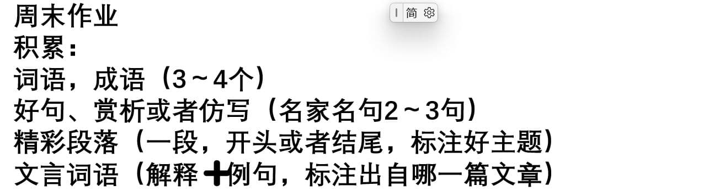
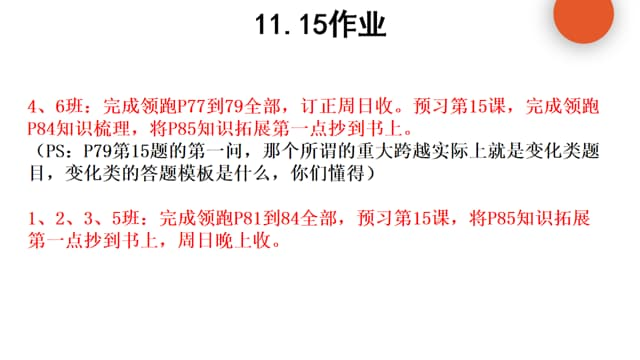
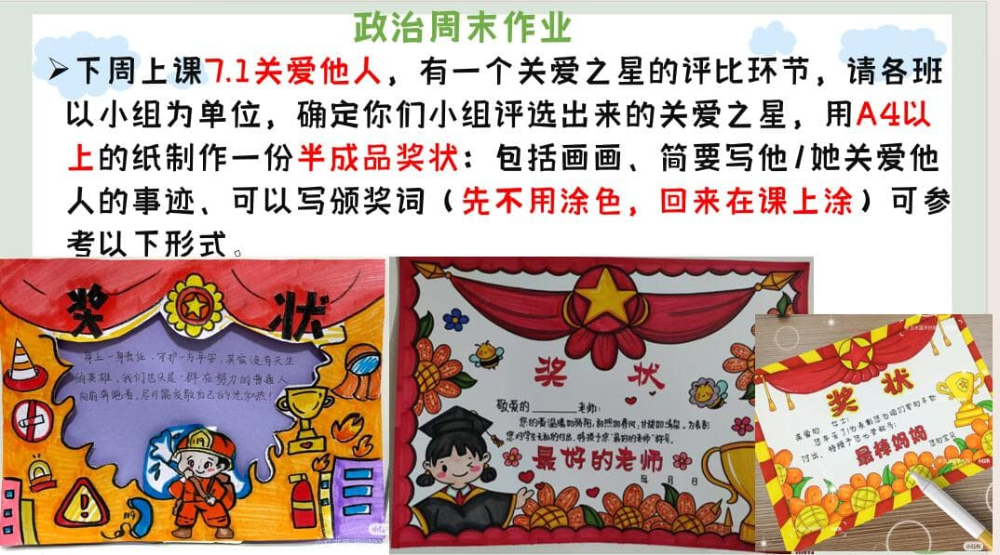

### 语文作业 ###

* 周末作业17-19
-----
### 数学作业 ###
1. 《导学案》P76-77
2. 《课时分层作业》P39
-----
### 英语作业 ###
1. 《课时分层作业本》P47-49
2. 用作文本写《高分突破》P89作文
-----
### 地理作业 ###
* 《学导练》P56-60
-----
### 历史作业 ###

-----
### 生物作业 ###
* 完成练习册“植物的生殖”P88-93，红笔订正
	* 要求：必须要认真做好，错题有相关红色字体解释
> 下周必须要有八下生物书
-----
### 物理作业 ###
* 《课堂本》补完*平面镜成像*前面的内容
-----
### 政治作业 ###

-----
