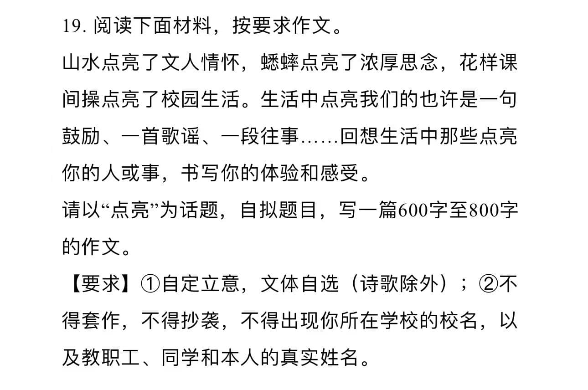
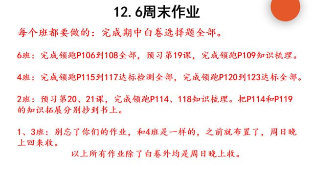
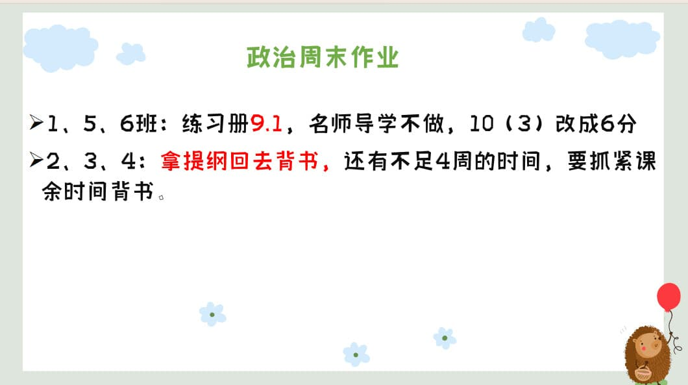

### 语文作业 ###
1. 
2. 《周末作业》十一（P20-22）
-----
### 数学作业 ###
1. 《导学案》P104-105
2. 《课时分层作业》P53
-----
### 英语作业 ###
1. 《课时分层作业本》M10U2~模块综合能力提升（P66-70）
-----
### 地理作业 ###
* 学导练大本80-83页工业部分，素养要写。
    * 红笔改正。周日收。
-----
### 历史作业 ###

-----
### 生物作业 ###
1. 《金榜学案》P119-123
2. 将笔记[1](../hw/_images/14b1.jpg)
[2](../hw/_images/14b2.jpg)
[3](../hw/_images/14b3.jpg)做回书本P34-35空白处
-----
### 物理作业 ###
* 《同步课堂本》 第5节 光的色散
    * 订正，周日晚收
-----
### 政治作业 ###

-----
