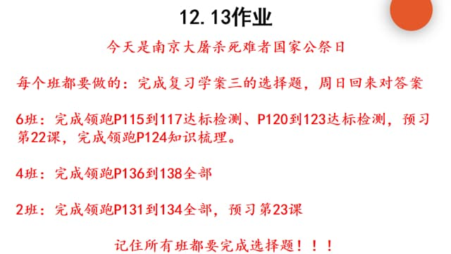

### 语文作业 ###

-----
### 数学作业 ###
* 导学案P121 P123 P124 P125
-----
### 英语作业 ###
1. 《课时分层作业本》M11U3+模块综合能力提升（P75-77）
    * 周日晚收
2. 《喜阅阅读》
3. 翼课网
-----
### 地理作业 ###
* 完成学导练大本90-93页，素养选做，红笔改正
-----
### 历史作业 ###

-----
### 生物作业 ###
* 完成练习册“人的性别遗传”相关所有的题，红笔订正
    * 要求：必须要认真做好，错题有相关红色字体解释
-----
### 物理作业 ###
* 《课下本》 第2节 密度
-----
### 政治作业 ###

-----
