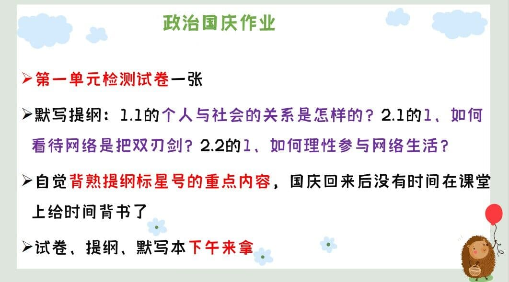

### 语文作业 ###
1. 《名著阅读》P6-9（1-16题）
-----
### 数学作业 ###
1. 补完导学案和课时作业
2. 单元分层11,12章的A组
-----
### 英语作业 ###

-----
### 地理作业 ###

-----
### 历史作业 ###

-----
### 生物作业 ###
* 金榜练习册完成到P49**（包括单元与单元之间的考点突破）**

?>国庆放假回来那晚就收起

?>国庆回来抽查生物书本笔记

!>要求：必须要认真做好，错题有相关红色字体解释

-----
### 物理作业 ###
* 第
-----
### 政治作业 ###

-----
