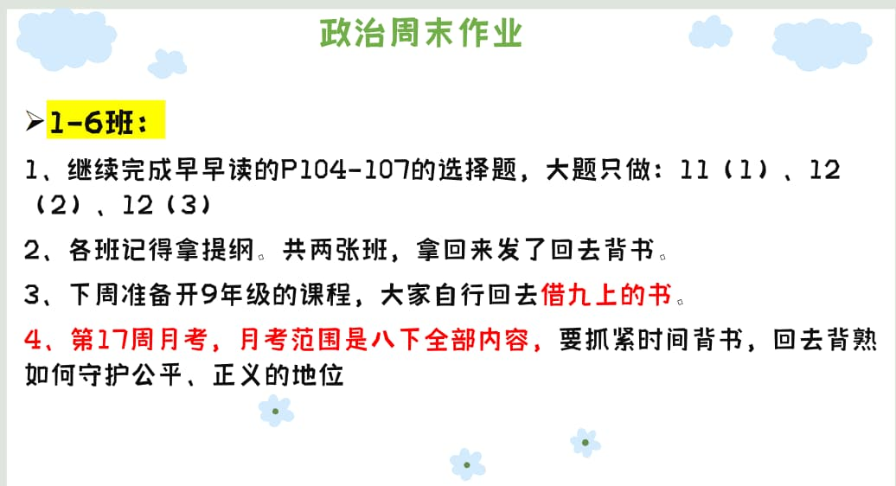

### 语文作业
1. 用作业本抄《礼记二则》的原文、重点字词、重点句子翻译
2. 重写作文
---

### 数学作业
1. 《导学案》P6-7
2. 《课时分层作业》P3
3. 用本子做八下《导学案》一次函数错题
---

### 英语作业
1. 复习学案（期中） 作文也写
2. 翼课网
---

### 地理作业
* 高分突破大本1-115页，118-119、121、124页。
---

### 历史作业
* **无**
---

### 生物作业
1. 生物专项复习卷二）
2. 完成生物高分突破大本P242-P247
3. 完成配套“彩色填图册”P14-18
4. 完成配套“七年级生物教材基础特训卷二”
---

### 物理作业
1. 《课下本》P70-76 P78-79
2. 完成第十一章知识点的背诵
---

### 政治作业

---
