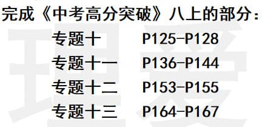
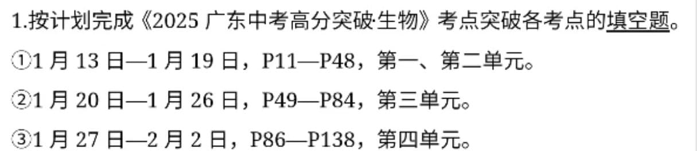

### 语文作业 ###
* 72分以下：
1. 用全新作业本完成:
    1. 抄写八下古诗词一遍，背诵默写一遍。
    2. 抄写八下前三单元字词三遍;
2. 阅读名著《钢铁是怎样炼成的》，用原稿纸写一篇阅读评论;
3. 制作设计《钢铁是怎样炼成的》或《经典常谈》腰封;
4. 制定个人特色作文集:
> 要求:
> 1. 从本学期写过的作文中选出（或网络上寻找）写得最好的8~10篇;
> 2. 对这些文章进行修改，并抄录(打印也可)在A4纸(原稿纸也可)上;
> 3. 一篇作文一张A4纸;
> 4. 设计作文集封面、卷首语、目录等，并把整理好的文章装订成作文集。

* 72~85分：
1. 用全新作业本完成:
    1. 抄写八下古诗词一遍，背诵默写一遍。
    2. 抄写八下前三单元字词两遍;
2. 阅读名著《钢铁是怎样炼成的》，用原稿纸写一篇阅读评论;
3. 制作设计《钢铁是怎样炼成的》腰封;
4. 制定个人特色作文集（同上）

* 85~96分：
1. 用全新作业本完成:
    1. 抄写八下古诗词一遍并背诵。
    2. 抄写八下前三单元字词两遍;
2. 阅读名著《钢铁是怎样炼成的》，用原稿纸写一篇阅读评论;
3. 制作设计《钢铁是怎样炼成的》腰封;
4. 制定个人特色作文集（同上）

* 96分及以上：
1. 用全新作业本完成:
    1. 抄写八下古诗词一遍并背诵。
    2. 抄写八下前三单元字词一遍;
2. 阅读名著《钢铁是怎样炼成的》，用原稿纸写一篇阅读评论;
3. 制作设计《钢铁是怎样炼成的》腰封;
4. 制定个人特色作文集（同上）
> 课堂表现与作业加分20以上减去一次古诗抄写，达到目标成绩减去两次字词抄写
-----
### 数学作业 ###
1. 《数学同步训练》全部
2. 《单元分层自测》全部
3. 复习学案（一）～（六）
-----
### 英语作业 ###

-----
### 地理作业 ###

-----
### 历史作业 ###
1. 抄八下历史年表10遍（自行寻找），回来收心考试八下占40%
2. 选择一个近代史人物，为他设计一幅宣传海报，用A3纸
-----
### 生物作业 ###

-----
### 物理作业 ###

-----
### 政治作业 ###
1. 新闻短评300字以上
2. 小介绍（下面3项作业三选一，图文并茂，200字以上）

-----
