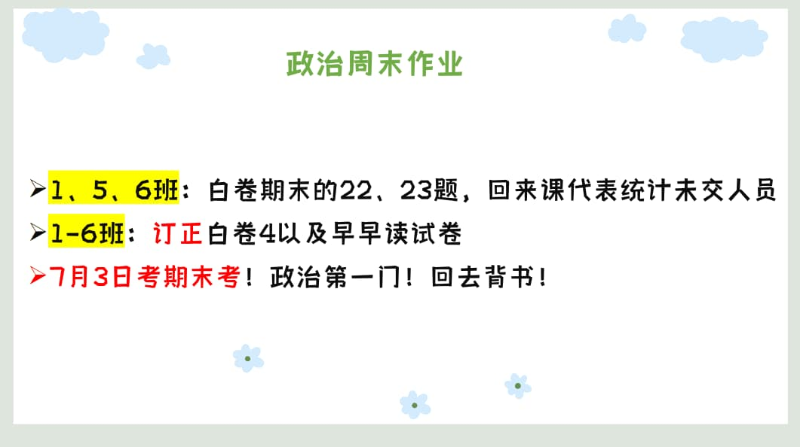

### 语文作业
1. 打印的复习资料每个专题做至少3道，（4个专题，至少12道）
2. 月考75分以上，学有余力的同学完成第五单元试卷的阅读部分（必做）
---

### 数学作业
1. 复习学案（一）
2. 复习学案（三）
---

### 英语作业
* 《喜阅阅读》P101 P103（一） P110 P124
---

### 地理作业
1. 手头的地理试卷都要写完，然后对答案改正。
2. 高分突破大本164-178页全部写完。
---

### 历史作业
* 自行复习
---

### 生物作业
1. 高分配套“彩色填图册”P27-28
2. 下发的白色生物仿真卷（一）
3. 大本练习册P253-P257“专题七”
---

### 物理作业
* **2023-2024学年度第二学期义务质量监测 八年级物理**
---

### 政治作业

1. 复习学案（四）
  
2. **2023-2024学年度第二学期义务质量监测 八年级道德与法治**  
  
---
