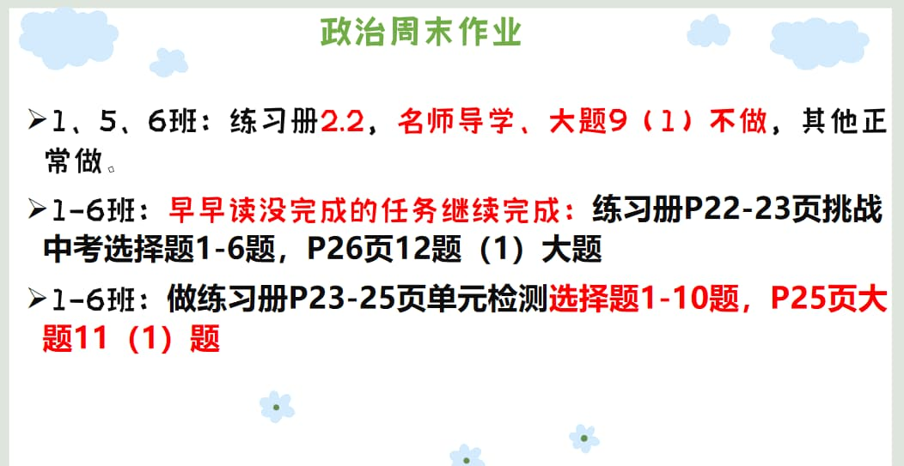

### 语文作业

* 写在作文纸上，不少于600字，文体不限，诗歌除外
---

### 数学作业
1. 《导学案》P32-33
2. 《课时分层作业》P17
---

### 英语作业
1. 《课时分层作业本》M3U3 P21-22
2. 《喜阅阅读》P19-20
3. 翼课网
4. 抄写M3U2的课文
5. 没背书的抄5次
---

### 地理作业
1. 《重难专题突破》农业专题：38-41页。
2. 《重难专题突破》工业专题：42-45页。
---

### 历史作业
1. 完成领跑P29到30知识梳理，预习第六课
2. 回家问问长辈是否记得1956—1976的事情
3. 回家搜索大跃进、人民公社化时期的宣传漫画
---

### 生物作业
* 《金榜学案》160-161所有题
    * 都要订正
> 生物通知：  
> 1.下周一定要带高分突破回来，包括它所有的配套资料（大本➕试卷➕答案➕考前满分特训与课后分层作业➕全彩知识清单与彩色填图册），缺一不可，都要用  
> 2.带4本生物书，务必带回，上完八下内容后，开始总复习  
> 3.下周周日生物周测，一定要按要求来，这个时间不能做其他科作业
---

### 物理作业
* 背诵第八章第1节知识提纲，下周星期三之内完成
---

### 政治作业

---
