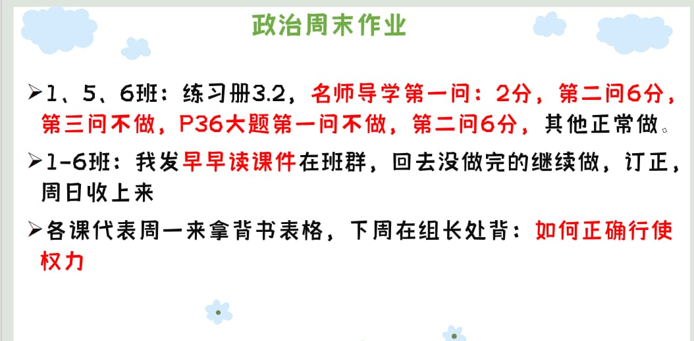

### 语文作业 ###
1. 阅读评论上传邑起共读。上传成功后把截图接龙。要求：写阅读评论；600字左右；2020的稿纸
2. 作文纸写一篇作文，以“我不由得加快了脚步”结尾，题目自拟，600字以上（可写景可写记叙文，可写社会层面题材）
3. 完成《周末作业》背面！名著阅读部分P6--9（即第一周到第四周）
4. 《高分突破》P79-80补完
-----
### 数学作业 ###
1. 补完导学案和课时作业
2. 单元分层11,12章的A组
-----
### 英语作业 ###
1. M4U1分层
2. 翼课网两份
3. 喜阅Week2+3
-----
### 地理作业 ###
* 第一章过关训练
-----
### 历史作业 ###
1. 《领跑》P28预习
2. 《课后精练P6-9》
3. 预习第六课
-----
### 生物作业 ###
* 金榜练习册完成到P49**（包括单元与单元之间的考点突破）**

?> **国庆放假回来那晚就收起**  
**国庆回来抽查生物书本笔记**

!>要求：必须要认真做好，错题有相关红色字体解释

-----
### 物理作业 ###
* 第一章 单元测试卷
-----
### 政治作业 ###

-----
