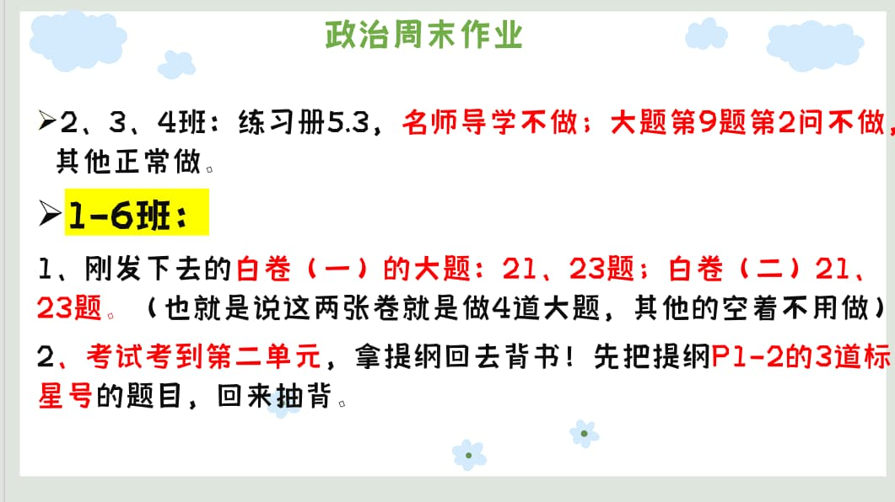

### 语文作业
1. 第三单元测试卷，写在试卷上，没位置的地方用便利贴写。
2. 做摘抄主题为“竹”包括词语，句子，诗句，赏析，仿写，文言词汇。
3. 复习经典常谈和背书（文言诗句）
---

### 数学作业
1. 完成**2022-2023期中数学试卷**
2. 《单元分层自测》勾股定理 二次根式A组 （P2-3 P8-9）
---

### 英语作业
1. 翼课网
2. 背M1-M5的单词
---

### 地理作业
* 完成 **2025模拟测试卷**
---

### 历史作业
1. 完成领跑P65到69全部
2. 预习第12课，完成P70知识梳理
3. 完成复习白卷一，认真写
---

### 生物作业
1. 高分突破大本P63之前都要完成并订正，其中包括P27、P48
2. 配套“基础知识特训卷一”的“一、第一单元基础知识”和“二、第二单元基础知识”
3. 配套“彩色填图册”的P2-P8
---

### 物理作业
* 完成“长白卷” 复习学案（一）
---

### 政治作业

---
