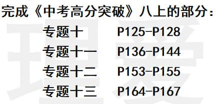
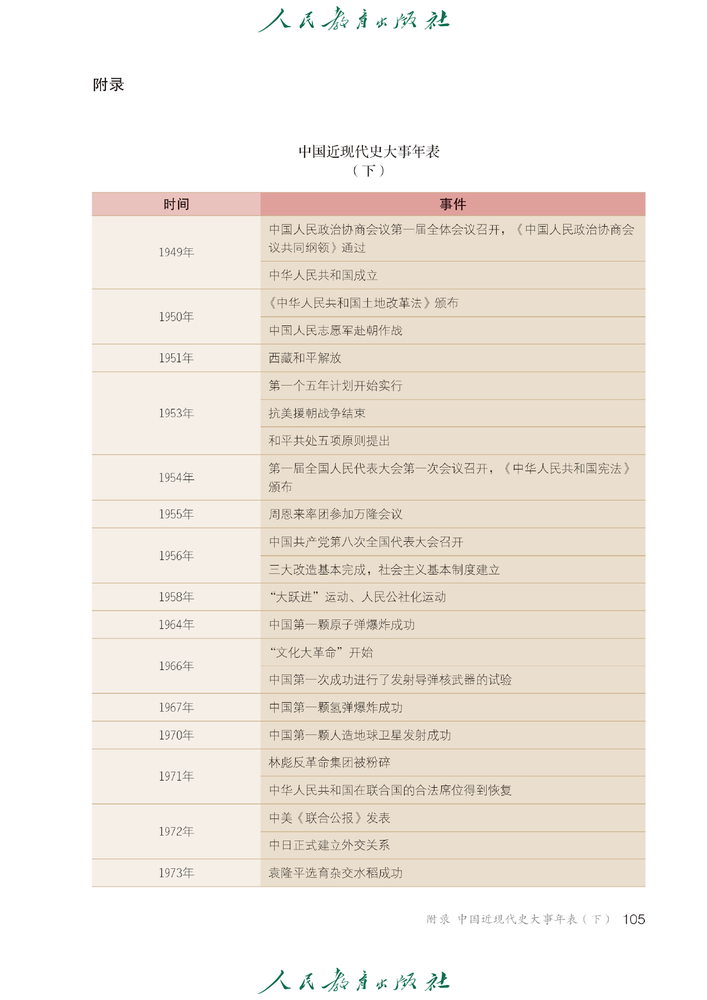
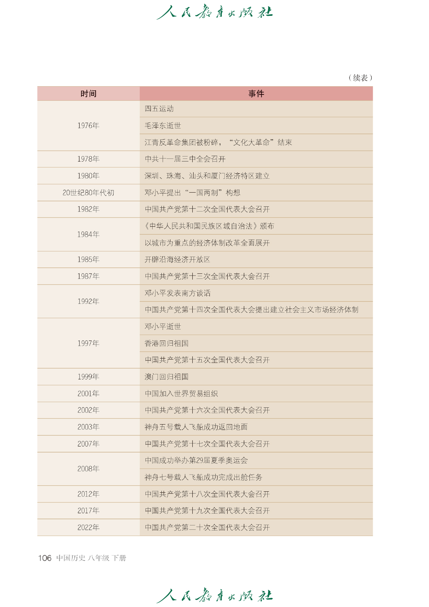
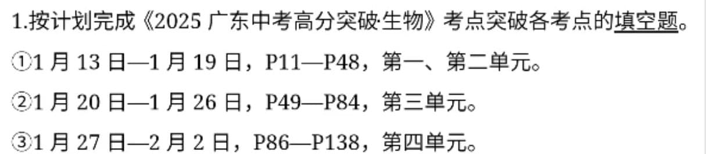
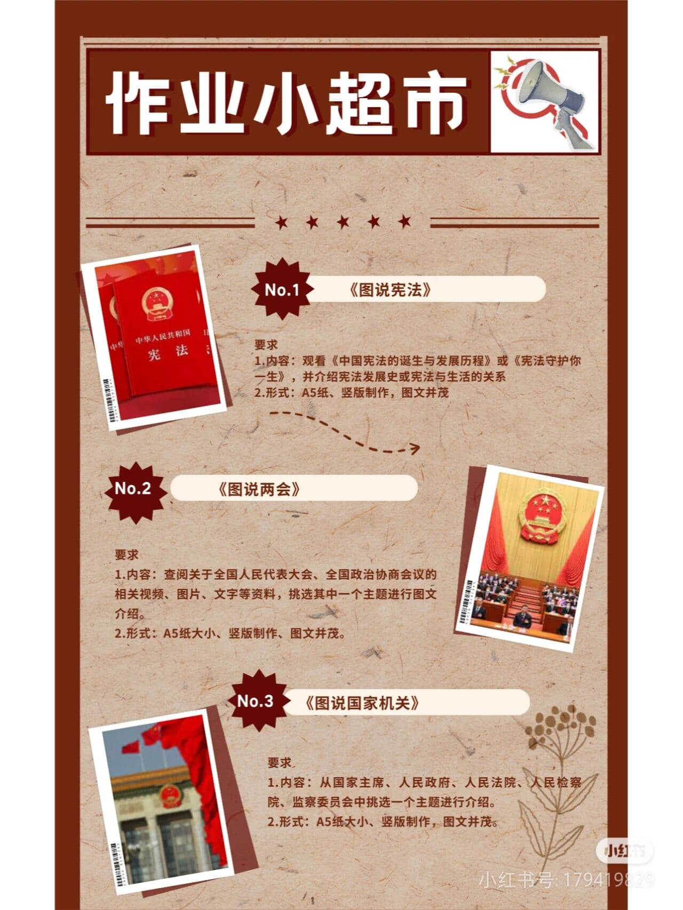

### 语文作业

- 72 分以下：

1. 用全新作业本完成:
   1. 抄写八下古诗词一遍，背诵默写一遍。
   2. 抄写八下前三单元字词三遍;
2. 阅读名著《钢铁是怎样炼成的》，用原稿纸写一篇阅读评论;
3. 制作设计《钢铁是怎样炼成的》或《经典常谈》腰封;
4. 制定个人特色作文集:
   > 要求:
   >
   > 1. 从本学期写过的作文中选出（或网络上寻找）写得最好的 8~10 篇;
   > 2. 对这些文章进行修改，并抄录(打印也可)在 A4 纸(原稿纸也可)上;
   > 3. 一篇作文一张 A4 纸;
   > 4. 设计作文集封面、卷首语、目录等，并把整理好的文章装订成作文集。

- 72~85 分：

1. 用全新作业本完成:
   1. 抄写八下古诗词一遍，背诵默写一遍。
   2. 抄写八下前三单元字词两遍;
2. 阅读名著《钢铁是怎样炼成的》，用原稿纸写一篇阅读评论;
3. 制作设计《钢铁是怎样炼成的》腰封;
4. 制定个人特色作文集（同上）

- 85~96 分：

1. 用全新作业本完成:
   1. 抄写八下古诗词一遍并背诵。
   2. 抄写八下前三单元字词两遍;
2. 阅读名著《钢铁是怎样炼成的》，用原稿纸写一篇阅读评论;
3. 制作设计《钢铁是怎样炼成的》腰封;
4. 制定个人特色作文集（同上）

- 96 分及以上：

1. 用全新作业本完成:
   1. 抄写八下古诗词一遍并背诵。
   2. 抄写八下前三单元字词一遍;
2. 阅读名著《钢铁是怎样炼成的》，用原稿纸写一篇阅读评论;
3. 制作设计《钢铁是怎样炼成的》腰封;
4. 制定个人特色作文集（同上）
   > 课堂表现与作业加分 20 以上减去一次古诗抄写，达到目标成绩减去两次字词抄写

---

### 数学作业

1. 《数学同步训练》全部
2. 《单元分层自测》全部
3. 复习学案（一）～（六）

---

### 英语作业

1. 翼课网听说训练 6 套。
2. 语篇训练：喜悦阅读（Week7 ～ Week9 P73-P104）和高分白卷。
3. 小组合作（5-8 人）创作一份英语话剧剧本，并自行排练，时长 3 分钟左右，下学期开学初班级初赛。
4. 自行预习八下内容，并完成八下 M1-M6 的单词背诵。

---

### 地理作业

---

### 历史作业

1. 抄八下历史年表 10 遍，回来收心考试八下占 40%
   
   
2. 选择一个近代史人物，为他设计一幅宣传海报，用 A3 纸

---

### 生物作业

---

### 物理作业

1. 科技小制作（五选一）：制作隔音房间模型：制作望远镜；自制潜望镜；照相机模型制作：自制孔明灯。
2. 1 月 13 日-17 日，教材 P29、30 第一章《复习与提高》（用作业本完成）：
3. 1 月 20 日-24 日，教材 P56 第二章《复习与提高》，P85、86 第三章《复习与提高》（直接在课本上作答）：
4. 1 月 27 日-31 日，教材 P111、112 第四章《复习与提高》，P136、137 第五章（复习与提高》（直接在课本上作答）：
5. 2 月 3 日-7 日，教材 P157、158 第六章《复习与提高》（用作业本完成）。

---

### 政治作业

1. 新闻短评 300 字以上
2. 小介绍（下面 3 项作业三选一，图文并茂，200 字以上）
   

---
