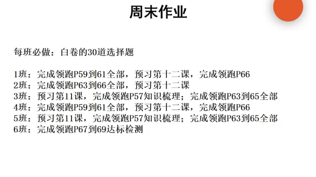
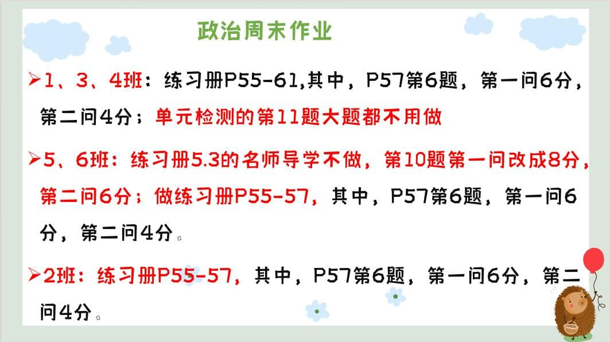

### 语文作业

1. 复习 1 ～ 3 单元词语和文言诗词。
2. 认真完成高分突破第二单元试卷，写在答题卡上。周日要检查，这套试卷跟我们考试题型一致，大家一定认真完成，不要浪费。（不写作文）
3. 复习学案一的文学类文本 阅读（15 ～ 20）

---

### 数学作业

1. 补完灰色的期中卷
2. 单元分层 11 章的 B 组

---

### 英语作业

1. 复习学案(一)

- 作文也要写

2. 口语易

---

### 地理作业

- 完成白色长长的试卷复习学案（一）。
  - 周日回来对答案。我一个个检查。

---

### 历史作业

---

### 生物作业

- 完成练习册“病毒”相关的题
  - 红笔订正

> 1. 期中自我测评范围：八上书本，考到病毒（包括病毒），周末回去自行认真复习 2.由于我们八上快讲完，紧接着学习八下的内容，所以需要同学们准备好人教版初中生物八年级下册的书本，第 11 周就要用
>
> - 可购买／借用亲戚朋友、学长学姐的／打印，因为这学期学习八下部分比较多，所以不建议整本打印，[电子版](https://github.moeyy.xyz/https://github.com/CMSZ002/hw/releases/download/Week-8/1.pdf)发出来是给各位同学由于书本来不及准备时打印几节内容先备用

---

### 物理作业

1. 《课下本》P37-45
2. 第二单元卷

---

### 政治作业

---
