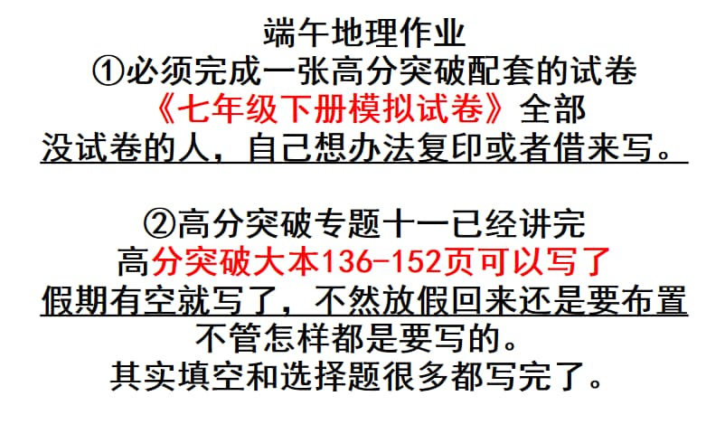

### 语文作业
* 自行复习
---

### 数学作业
1. 《导学案》P107 P110-111
2. 《单元分层自测》**一次函数 A组** P23-24
---

### 英语作业
1. 《高分突破》M9U2 M9U3 模块写作训练 P115-123
2. 《喜阅阅读》P87-88
---

### 地理作业

---

### 历史作业
* 八下领跑P106到111、P123到126全部
---

### 生物作业
1. 《高分突破》完成至P171
2. 完成 **生物模拟试卷（二）**
---

### 物理作业
1. 完成**第十一章 单元测试卷**
2. 《课下本》P84-87
---

### 政治作业

---
