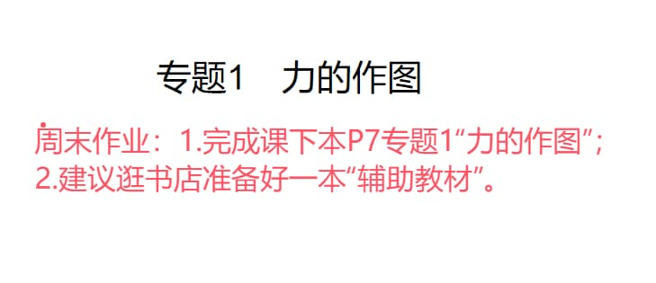

### 语文作业
* 《周末作业》（一）
---

### 数学作业
1. 《导学案》P12-13
2. 《课时分层作业》P7
---

### 英语作业
1. 《高分突破》M1U3（也写作文）
2. 《喜阅阅读》P3-4
3. 口语易
4. 没背完M1U2第4段，抄5次
---

### 地理作业
* 《高分突破》
    1. P209-210和P213-215的考点1、2
    2. P217-218全部
* 订正，周日收
---

### 历史作业
* **无**
---

### 生物作业
* 《金榜学案》P142-145
---

### 物理作业

---

### 政治作业
* **无**
---
